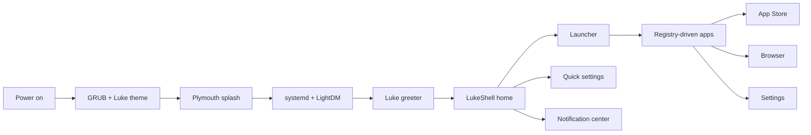
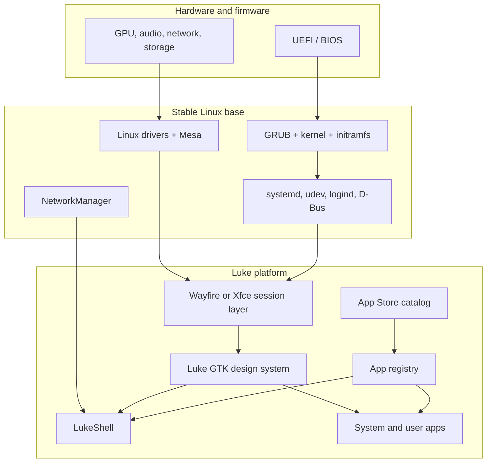

<div align="center">
  
  <h1>Luke</h1>
  <p><strong>A personal operating system built around focus, flow, and real tools.</strong></p>
  <p>
    <a href="https://github.com/Powerisvansh/LUKE-/tree/master/luke">Platform source</a>
    ·
    <a href="LUKE-OS-ANALYSIS.md">Architecture</a>
    ·
    <a href="plan.md">Roadmap</a>
  </p>
  <p>
    
    
    
  </p>
</div>

<p align="center">
  
</p>

## The idea

Luke is a rebuildable, app-centric Linux operating system project. It keeps the
reliable parts of a Linux system underneath while creating a single original
experience above them: boot, login, home, launcher, applications, settings,
notifications, and updates all belong to the same product language.

Luke is not a Linux distribution re-skin, a Windows clone, or an Android port.
The visual system, shell, icons, boot art, application framework, and system
applications are developed as Luke-native work.

> **Design principle:** preserve the machinery that makes a computer dependable;
> replace the surfaces that make it feel generic.

## Visual direction

The current design pass uses a mineral graphite base with warm saffron actions,
oxidized coral warnings, and pale paper text. The goal is a calm surface with
clear hierarchy, firm geometry, and enough contrast for older hardware.

<table>
  <tr>
    <td></td>
    <td><strong>Original identity</strong><br>Custom mark, wordmark, wallpaper generator, and icon family.</td>
    <td><strong>One system</strong><br>Shared GTK tokens and components across shell, greeter, and apps.</td>
    <td><strong>Real controls</strong><br>Network, audio, brightness, power, files, installs, and updates use real system APIs.</td>
  </tr>
</table>

## Experience map



## What exists today

| Area | Current implementation | State |
| --- | --- | --- |
| Shell | Fullscreen LukeShell with home, launcher, favorites, recents, dock, and quick settings | Active |
| App platform | Metadata registry, categories, search, desktop entries, launch, install, update, uninstall | Active |
| Browser | WebKitGTK browser surface with address/search, navigation, home, bookmarks, and history | Active |
| App Store | Remote catalog, checksum validation, safe archive extraction, install/update/remove | Active |
| Design system | Shared GTK CSS, original assets, tokens, icon library, wallpaper generator | In progress |
| Boot visuals | GRUB and Plymouth themes with reversible root scripts | Staged |
| Greeter | Custom LightDM greeter with backup-aware installer | Staged |
| Waydroid | Service and firewall templates | Optional / target-dependent |

Built-in applications include Settings, Calculator, Calendar, Clock, Monitor,
Network, Task Manager, About Luke, App Launcher, Quick Settings, and Luke
Browser. The registry is the source of truth, so applications are not wired
individually into the desktop.

## Architecture



The product target is a minimal Debian/Ubuntu-based root filesystem. The
kernel, drivers, filesystem, system services, and hardware support remain
ordinary dependable Linux components. Luke owns the user-facing layer and the
contracts between shell, framework, and applications.

## Repository map

```text
luke/
├── apps/          GTK system applications
├── framework/     shared UI, CSS, paths, assets, registry, browser helpers
├── shell/         fullscreen home surface and shell client
├── launcher/      standalone application launcher
├── greeter/       custom LightDM greeter
├── design/        tokens, artwork, icon library, generated assets
├── boot/          GRUB/Plymouth asset and install tooling
├── build/         minimal rootfs and kernel checklists
├── wayland/       Wayfire session configuration
├── waydroid/      Android container service and firewall templates
├── deploy.sh      user-level deployment to a mounted target
└── apply-root.sh  root-level greeter/runtime deployment
catalog/
└── apps.json      remote App Store catalog format
```

## Deploy Luke

> These scripts target a mounted Luke root filesystem. Verify the mount before
> using `sudo`; root-level changes create backups, but a wrong target is still
> the wrong target.

```bash
cd luke

# User-level shell, framework, applications, assets, and autostart files
./deploy.sh /media/aman/LUKE-ROOT

# Generate and install boot visuals
python3 boot/gen-assets.py
sudo ./boot/apply-boot.sh /media/aman/LUKE-ROOT

# Install the custom LightDM greeter and runtime packages
sudo ./apply-root.sh /media/aman/LUKE-ROOT
```

The boot script does not modify firmware, partition tables, or the kernel. It
backs up the GRUB configuration and keeps recovery kernels reachable. The root
filesystem and data partition are not reformatted by any Luke deployment script.

## Build a bootable USB

For a full live USB image, use the packaged installer at [luke/boot/build-live-usb.sh](luke/boot/build-live-usb.sh):

```bash
sudo bash luke/boot/build-live-usb.sh --device /dev/sdX --username aman --suite bookworm
```

This script creates a GPT USB layout with an EFI partition and a root filesystem,
installs Debian minbase, copies the Luke project into the live system, and
installs GRUB for UEFI boot. It is designed for a removable USB target and keeps
the source tree in the live home directory for direct use on first boot.

## Development

Requirements depend on the target distribution, but development normally needs
Python 3, GTK 3, PyGObject, `rsync`, a working X11 or Wayland session, and the
system utilities used by the real controls. WebKitGTK 4.1 is needed for the
full browser surface.

Run a focused app locally:

```bash
cd luke
PYTHONPATH="$PWD/framework:$PWD/apps/calculator" \
  python3 apps/calculator/main.py
```

Validate the whole Python surface:

```bash
cd luke
python3 -m compileall -q design framework apps launcher greeter shell bin tools
```

The project does not claim complete device readiness until the mounted target
has been rebooted and the boot, login, shell, browser, app store, networking,
and recovery paths have been tested on hardware.

## App Store format

The store reads a versioned JSON catalog. Set `LUKE_APP_CATALOG` to point at a
development catalog; otherwise it uses the repository catalog URL.

```json
{
  "version": 1,
  "apps": [
    {
      "id": "example",
      "name": "Example",
      "version": "1.0",
      "author": "Luke",
      "desc": "An example Luke app",
      "url": "https://example.org/example.tar.gz",
      "sha256": "..."
    }
  ]
}
```

Bundles must contain an `app.json` descriptor. Luke validates the app ID,
SHA-256 checksum, and archive paths before installation. Downloaded bundles
live in `~/.luke/store/apps`, outside the source-synced application directory.

## Roadmap

- [x] Foundation, snapshots, registry, and deployment workflow
- [x] Fullscreen shell, launcher, real system apps, browser foundation
- [x] App Store catalog and bundle lifecycle
- [ ] Finish the new visual system across shell, greeter, and boot art
- [ ] Add notification center and task switching polish
- [ ] Complete device deployment and acceptance testing

The detailed roadmap is in [plan.md](plan.md), while the system audit and
recovery strategy are in [LUKE-OS-ANALYSIS.md](LUKE-OS-ANALYSIS.md).

## License

No license has been declared yet. Until one is added, treat the repository as
all rights reserved and ask before redistributing or reusing the code.
